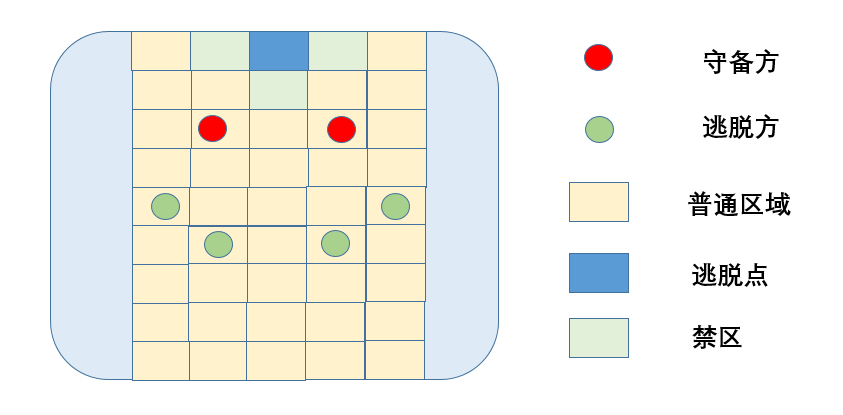

## 逃出生天

### 最初想法

最初想法源于高三无聊时和同学在教室外天台走格子游戏，在这个游戏中分别有两方角色，逃脱方和守备方。守备方的目标是抓捕所有逃脱方，逃脱方的目标是我方任意一员抵达逃脱点，如下图所示：

守备方和逃脱方均为不同英雄角色，不同角色带有不同技能，在游戏开始前抽取后分配给玩家，在猜拳阶段，双方角色通过剪刀石头布计算赢了对面多少人作为行动步数。逃脱方先行动完毕后守备方行动。在行动前或者行动中角色可以发动对应技能。

接下来描述部分曾经设计的角色作为参考:

- 逃脱方
  - 赌徒（技能豪赌）：行动前你可以选择一名对方角色进行猜拳，胜利方获得一步行动步数，若猜拳胜利，你可继续发动豪赌技能。
  - 毒枭（技能蛊毒）：你可吸取周围四格其中一人的行动步数，你的行动步数上限为全场当前存活人数。
  - 飞贼（技能轻功）：仅能发动一次，当你被抓捕时可以进行闪避，并选择当前所站位置周围四格其中一个作为闪避后的位置。
  - 盗墓贼（技能盗墓）：当你在猜拳阶段赢了守备方所有人（守备方存活人数需大于2人）时，你可以发动沿着单一方向直线行动任意距离，并潜藏于地底，在下次行动时你需要消耗一个行动步数返回地面。当你在地底时，守备方无法攻击到你。
  - 莽汉（技能鲁莽）：当你将所有行动步数向同一方向前进时，你可以向该方向多行动一步。
  - 单身汉（技能孤身）：所有人行动结束后，你周围四格不能存在人员，你可以选择自己或者对方往与你相对方向后退一格。
  - 诈骗者（技能狡诈）：在逃脱方人数大于守备方时，守备方猜拳阶段不能与你计算获得步数，逃脱方可以可以与你计算获得步数（即将作为守备方进行猜拳计算），你在猜拳阶段的行动步数计算则不做改动。
  - 义军首领（技能起义）：仅能发动一次，除自己以外所有逃脱方前进一格。
  - 杀手（技能冷血）：当你行动至守备方周围四格时，你可以消耗一个行动步数与对方同归于尽。
  - 炸弹狂（技能引爆）：你可以消耗行动步数释放炸弹使与你相邻的守备方往与你相对的方向后退一格。
  - 替罪羊（技能顶替）：你可以消耗行动步数让守备方和你往互相靠近一格。
- 守备方
  - 神探（技能识破）：你可以率先于场上所有角色行动并查看你周围四格人员其中一个的角色。
  - 典狱长（技能掌控）：你可以消耗自己的行动步数指挥对方角色向某个方向行动。消耗的行动步数和指挥的角色可以任意组合（即当你拥有3个行动步数时你可以指挥a向左走1步，指挥b向右走1步后向下走1步；也可以指挥a向下走1步后自己行动2步）。
  - 门卫（技能守卫）：当你碰到禁区时可以立刻向禁区周围任意一格行动一步，该行动不消耗你的行动点。
  - 剑人（技能突刺）：行动结束后你可以朝着最后的行动方向前方进行一次攻击。
  - 警犬（技能兽行）：你走日字，不能正常走。
  - 警花（技能高冷）：你的周围四格为禁区。
  - 卧底（技能潜藏）：开局时你的身份为逃脱方，起始位置在逃脱方一边。
  - 交警（技能指挥）：你可以消耗行动步数交换对面两名角色位置。
  - 巡警（技能探照）：你可以向指定方向打出一个探照灯，该线此回合禁止跨越。